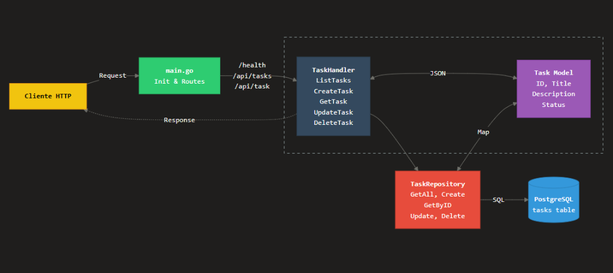

# ARGolang

[](https://go.dev/)

Proyecto base de API REST robusta desarrollada en Go, utilizando PostgreSQL para la persistencia de datos. Diseñada con una arquitectura limpia y modular.

## Arquitectura del Sistema



---

## Funcionalidades

- CRUD completo de tareas (Tasks).
- Validación de datos de entrada.
- Conexión robusta con PostgreSQL mediante sqlx.
- Gestión de variables de entorno con .env.
- Pipeline de CI/CD configurado con GitHub Actions.
- Estructura de carpetas estandarizada para Go.

## Tecnologías

- **Lenguaje:** [Go](https://go.dev/) (v1.21+)
- **Base de Datos:** [PostgreSQL](https://www.postgresql.org/)
- **Librerías principales:**
  - `sqlx`: Extensión para database/sql para facilitar consultas.
  - `godotenv`: Carga de variables de entorno.
  - `lib/pq`: Driver de PostgreSQL para Go.

## Estructura del Proyecto

```text
.
├── cmd/api             # Punto de entrada de la aplicación
├── internal/           # Lógica privada del negocio
│   ├── database        # Conexión y configuración de DB
│   ├── handlers        # Controladores HTTP (Manejo de requests)
│   ├── models          # Definiciones de estructuras de datos
│   └── repository      # Capa de persistencia (SQL)
├── scripts/            # Scripts útiles (DB, setups)
├── tests/              # Pruebas automatizadas
└── docs/               # Documentación y assets
```

## API Endpoints

| Método | Endpoint | Descripción |
| :--- | :--- | :--- |
| `GET` | `/health` | Verifica el estado de la API |
| `GET` | `/api/tasks` | Lista todas las tareas |
| `POST` | `/api/tasks` | Crea una nueva tarea |
| `GET` | `/api/task?id={id}` | Obtiene una tarea por ID |
| `PUT` | `/api/task?id={id}` | Actualiza una tarea existente |
| `DELETE` | `/api/task?id={id}` | Elimina una tarea |

## Inicio Rápido

1. **Requisitos**: Tener instalado Go 1.21+ y PostgreSQL.
2. **Configuración**:

   ```bash
   cp .env.example .env
   # Edita el archivo .env con tus credenciales de base de datos
   ```

3. **Ejecución**:

   ```bash
   make run
   ```

4. **Pruebas**:

   ```bash
   make test
   ```
